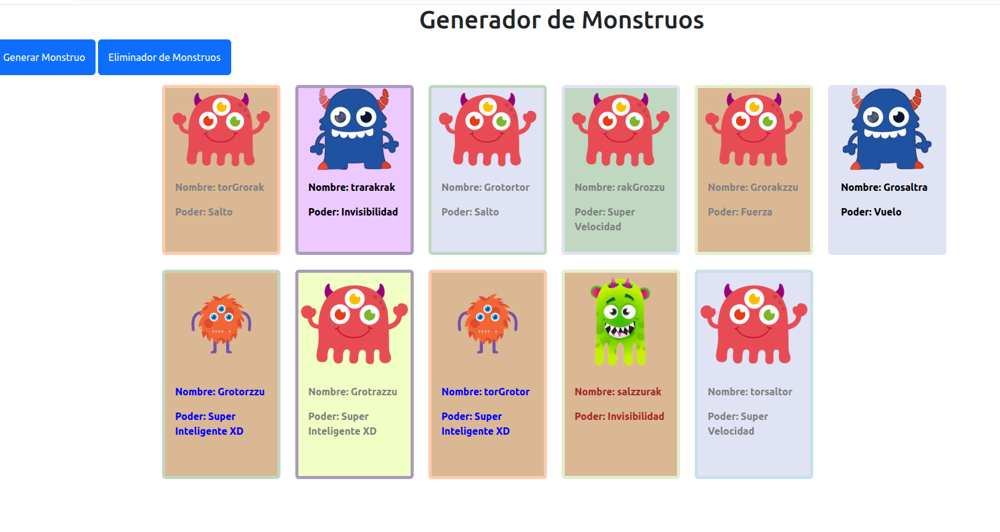

# Generador de Monstruos

Este proyecto es una aplicación web simple creada con JavaScript que permite generar tarjetas aleatorias de monstruos, con nombre, poder, color y estilo únicos cada vez que se presiona un botón. También incluye la funcionalidad de eliminar todos los monstruos generados.

## 📁 Estructura del Proyecto

El proyecto contiene:

- Un botón para generar monstruos (`#Generador`)
- Un botón para eliminar todos los monstruos (`#Eliminador`)
- Un contenedor para mostrar las tarjetas de monstruos (`.monstruo`)
- Recursos como imágenes de monstruos (`./monstruo.png`, `./monstruo2.png`, etc.)

## ⚙️ Funcionamiento del Código

### Variables

- `SilabasNombres`: Arreglo con sílabas usadas para formar nombres aleatorios.
- `Poderes`: Arreglo con poderes únicos para asignar a cada monstruo.
- `colores`: Paleta de colores para el fondo y bordes de las tarjetas.
- `letras`: Colores para el texto dentro de la tarjeta.
- `img`: Arreglo con rutas de imágenes de monstruos.

### Función `Crear()`

1. Genera un nombre aleatorio uniendo tres sílabas al azar.
2. Selecciona un poder aleatorio del arreglo `Poderes`.
3. Elige colores aleatorios para el fondo, el borde y el texto.
4. Selecciona aleatoriamente una imagen para el monstruo.
5. Construye una tarjeta HTML (`
`) con estos datos.
6. Inserta la tarjeta en el contenedor `.monstruo` con `innerHTML +=`.

### Eventos

- Al hacer clic en el botón con ID `#Generador`, se llama a la función `Crear()` para añadir un nuevo monstruo al DOM.
- Al hacer clic en el botón con ID `#Eliminador`, se borra todo el contenido del contenedor `.monstruo`.

## 🖼️ Ejemplo de Monstruo Generado

Una tarjeta típica incluirá:

- Imagen del monstruo
- Nombre generado aleatoriamente (por ejemplo: "Grotrakzzu")
- Poder asignado aleatoriamente (por ejemplo: "Rayos en las manos")
- Fondo colorido y borde decorativo
- Texto con color variable

## 📌 Imagen

